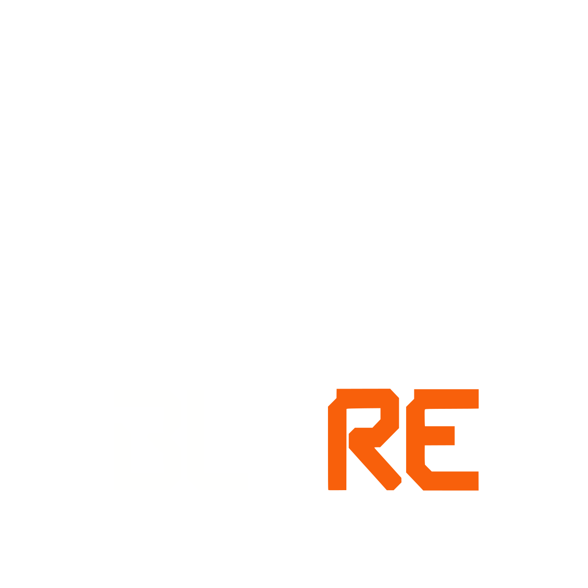

<p align="center">
  
</p>

<h1 align="center">Play Blacklight: Retribution Again</h1>

<p align="center">
  Install BLRevive for a Steam copy of Blacklight or the community archive.
</p>

<p align="center">
  <a href="https://github.com/Vyrium/BLRevive-Play-Fix/releases/latest"><strong>Download the latest player release</strong></a>
  ·
  <a href="https://blrevive.gitlab.io/wiki/guides/user/getting-started/">BLRevive setup guide</a>
  ·
  <a href="https://blrevive.gitlab.io/wiki/">BLRevive community</a>
</p>

> [!IMPORTANT]
> Download the ZIP attached to the latest GitHub **Release**. Do not download GitHub's automatically generated **Source code** ZIP. It does not contain the ready-to-use launcher.

## Get back in the game

You need a Windows PC, Steam installed and signed in, and a copy of the Blacklight: Retribution game files.

1. **Get Blacklight: Retribution.**
   - **Already own it on Steam?** Install it normally from your Steam Library.
   - **Do not own it on Steam?** Follow BLRevive's [Download BL:R guide](https://blrevive.gitlab.io/wiki/guides/user/getting-started/#download-blr) and extract the community archive somewhere permanent.
2. **Download this tool** from the [latest release page](https://github.com/Vyrium/BLRevive-Play-Fix/releases/latest), then extract the entire ZIP.
3. **Double-click `Install BLRevive Steam Play Fix.bat`.**
4. **Choose your Blacklight folder if asked.** You can select either the main `blacklightretribution` folder or its `Binaries\Win32` folder. Approve the Windows administrator prompt if missing game components need to be installed.
5. **Play.**
   - **Steam owner:** open Blacklight: Retribution in your Steam Library and press **PLAY**.
   - **Archive player:** Steam opens an **Add Non-Steam Game** window with `Play BLRevive.exe` selected. Click **Add Selected Programs**, then launch **Play BLRevive** from your Steam Library.

You do not need to copy DLL files, enter launch options, edit configuration files, or install old game components by hand.

### What this fixes

- Connects the original Blacklight client to the BLRevive ZCure and Presence services.
- Makes Steam's normal **PLAY** button work for existing owners.
- Adds **Play BLRevive** to an archive player's Steam Library and creates a desktop fallback shortcut.
- Detects and installs the original DirectX, Visual C++, .NET, and PhysX requirements that Steam would normally handle.
- Preserves the real Blacklight game executable instead of patching it.

## If something does not work

Run **`Diagnose.bat`** from the folder where you extracted this tool. If the game is elsewhere, select the Blacklight folder or its `Binaries\Win32` folder when asked. It creates:

```text
BLReviveSteamPlayFix-Diagnostic.txt
```

Attach that file when asking the BLRevive community for help. It reports the launcher, configuration, game files, prerequisite status, the latest prerequisite installation log, and recent launcher activity. Common password and authentication-token values are redacted.

Common fixes:

- **The installer cannot find Blacklight:** select the extracted game folder or `Binaries\Win32` when the folder picker opens.
- **Steam Verify replaced the launcher:** run `Install BLRevive Steam Play Fix.bat` again.
- **The game is missing from an archive player's Steam Library:** in Steam, select **Games → Add a Non-Steam Game to My Library**, browse to `[BLR]\Binaries\Win32\Play BLRevive.exe`, and add it.
- **The game still reports a missing DLL:** run the installer again, allow the administrator prompt, and include the diagnostic report if it still fails.

## Uninstall

Double-click **`Uninstall.bat`** in the extracted player package.

- For Steam owners, the original Steam/BattlEye launcher is restored.
- For archive players, the managed launcher, AppID file, and desktop shortcut are removed or restored to their previous state.
- Shared Windows prerequisites remain installed because other games may use them.
- Remove the **Play BLRevive** entry from the Steam Library separately. The uninstaller does not edit Steam's binary shortcut database.

---

## Technical and security details

The sections below document the installer, launcher, downloaded prerequisites, and release process.

### Installation modes

| Selected game copy | Detection | Result |
| --- | --- | --- |
| Licensed Steam installation | Its directory matches a Steam library containing `appmanifest_209870.acf` | Preserves AppID `209870`, relies on Steam for prerequisites, and replaces Steam's obsolete BattlEye bootstrap with the BLRevive launcher. |
| Community archive | No matching licensed Steam manifest | Installs missing prerequisites, manages `steam_appid.txt` with AppID `480`, installs `Play BLRevive.exe`, creates a desktop shortcut, and opens Steam's Add Non-Steam Game flow. |

AppID `480` follows the [BLRevive ZCure instructions](https://blrevive.gitlab.io/wiki/guides/user/ZCure/) for players who do not own AppID `209870`.

### Original game prerequisites

[SteamDB lists](https://steamdb.info/app/209870/depots/) six shared redistributable depots for Blacklight: Retribution:

| Steam depot | Component | Installer behavior |
| ---: | --- | --- |
| `228983` | Visual C++ 2010 Redistributable | Installs SP1 x86, plus x64 on 64-bit Windows, when the required runtime files are absent or outdated. |
| `228984` | Visual C++ 2012 Redistributable | Installs Update 4 x86, plus x64 on 64-bit Windows. Requires runtime version `11.0.61030.0` or newer. |
| `228985` | Visual C++ 2013 Redistributable | Installs x86, plus x64 on 64-bit Windows. Requires runtime version `12.0.40664.0` or newer. |
| `228990` | DirectX June 2010 Redistributable | Installs the legacy side-by-side DirectX libraries used by older games, including D3DX9 and XInput 1.3. It does not replace modern DirectX. |
| `229003` | .NET 4.0 Client Profile | Accepts an installed .NET Framework 4.x runtime; installs Microsoft's .NET Framework 4.8 runtime only when .NET 4.x is absent. |
| `229031` | PhysX System Software 9.12.1031 | Installs the original NVIDIA PhysX system package when the PhysX runtime is absent. |

Downloads are cached in:

```text
%LOCALAPPDATA%\BLReviveSteamPlayFix\Prerequisites
```

The installer downloads redistributables only from Microsoft or NVIDIA endpoints and checks the Windows Authenticode signature and expected publisher before executing each file. An incomplete or untrusted cached download is deleted and downloaded again.

Download, verification, and installation details are recorded in:

```text
%LOCALAPPDATA%\BLReviveSteamPlayFix\Prerequisites\BLRevivePrerequisites.log
```

### What changes in the game folder

| File or folder | Purpose |
| --- | --- |
| `FoxGame-win32-Shipping.exe` | The existing real Blacklight executable. It is never modified. |
| `FoxGame-win32-Shipping_BE.exe` | BLRevive compatibility launcher installed under the filename expected by Steam. |
| `FoxGame-win32-Shipping_BE.official-backup.exe` | Preserved original Steam/BattlEye launcher, when one exists. |
| `Play BLRevive.exe` | Launcher used by archive installations and their Non-Steam Game entry. |
| `steam_appid.txt` | Set to `480` only for archive mode. Any different pre-existing file is backed up for uninstall. |
| `BLReviveLauncher.ini` | ZCure and Presence endpoint configuration. Existing configuration is preserved. |
| `BLReviveSteamLauncher.log` | Rotating runtime diagnostic log created when the launcher runs. |
| `BLReviveSteamPlayFix\` | Uninstall, diagnostics, prerequisite checker, README, installation metadata, and any managed AppID backup. |

### What the launcher does

Steam normally starts the obsolete BattlEye bootstrap, `FoxGame-win32-Shipping_BE.exe`. The replacement launcher:

1. Receives arguments from Steam or the player's shortcut.
2. Removes duplicate or obsolete ZCure and Presence arguments.
3. Preserves unrelated Steam and player arguments.
4. Reads the current endpoints from `BLReviveLauncher.ini`.
5. Starts the untouched `FoxGame-win32-Shipping.exe` with one authoritative set of endpoint values.
6. Waits for the game to exit so Steam keeps its Running state and playtime tracking.
7. Records a troubleshooting log, redacting common password- and token-style values.

The runtime launcher makes no network requests, injects no code, changes no registry settings, and does not patch the game. The original game handles ZCure and Presence networking. The installer contacts Microsoft and NVIDIA only when a prerequisite download is needed.

### Default BLRevive endpoints

| Service | Host | Port |
| --- | --- | ---: |
| ZCure | `blrrevive.ddd-game.de` | `80` |
| Presence | `blrrevive.ddd-game.de` | `9004` |

These values live in `BLReviveLauncher.ini`, so an endpoint can be updated without rebuilding the launcher.

### Release integrity

The player installer validates the packaged launcher's SHA-256 digest, product identity, and version before copying it. Release tooling builds the x86 launcher from source, stages only player-facing files, hashes the release, and runs a disposable install/diagnose/uninstall test against the exact generated ZIP. The smoke test also confirms that a modified launcher payload is rejected.

## Development

### Build the launcher

Regenerate the multi-resolution icon from the SVG master:

```bat
tools\icon\BuildIconTool.bat
```

Build the x86 GUI launcher:

```bat
tools\launcher\BuildLauncher.bat "resources\BLReviveSteamLauncher.ico"
```

The output is `tools\launcher\BLReviveSteamLauncher.exe`.

### Build and test a player release

```powershell
powershell.exe -NoProfile -ExecutionPolicy Bypass `
    -File "tools\distribution\BuildRelease.ps1"
```

This produces `dist\BLRevive-Steam-Play-Fix-1.1.0.zip` and `dist\SHA256SUMS.txt`, then tests the exact ZIP. The disposable package test skips system prerequisite installation.

### Repository layout

The player ZIP exposes only three runnable files at its root:

- `Install BLRevive Steam Play Fix.bat`
- `Uninstall.bat`
- `Diagnose.bat`

Implementation scripts are under `scripts`, launcher source is under `src`, packaged resources are under `resources`, and developer-only release/build tooling is under `tools`.

## License

BLRevive Steam Play Fix is open-source software released under the [MIT License](LICENSE).
